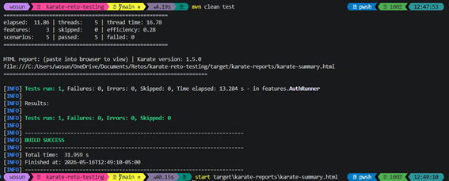
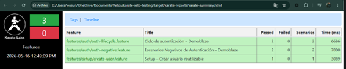

# Karate Demoblaze Auth Testing

Suite de pruebas automatizadas de API usando **Karate DSL** sobre **Maven**, que cubre los flujos de autenticación (signup y login) de la API pública de [Demoblaze](https://api.demoblaze.com).

---

## Estructura del Proyecto

```text
src/test/java/
├── karate-config.js                        # URL base y configuración global
├── data/
│   ├── signup-request.json                 # Payload base para registro de usuario
│   └── login-request.json                  # Payload base para inicio de sesión
├── features/
│   ├── setup/
│   │   └── create-user.feature             # Setup reutilizable: crea un usuario único
│   ├── auth/
│   │   ├── auth-lifecycle.feature          # Escenarios positivos: signup y login exitosos
│   │   └── auth-negative.feature           # Funcionalidades negativas: duplicado y contraseña incorrecta
│   └── AuthRunner.java                     # Runner JUnit5 con ejecución paralela
```


---

## 1. Prerequisitos:
** Aquí describiremos las versiones de las dependencias, packages u otra tecnología que necesito tener configurado en mi maquina local.

- Maquina local con el sistema operativo macOS, Windows o Linux
- IDE VS Code, IntelliJ IDEA o Eclipse
- Maven version 3.9+ (debe estar en la variable de entorno)
- JDK versión 17+ (debe estar en la variable de entorno)
- Acceso a `https://api.demoblaze.com`

## 2. Comandos de instalación
** Aquí describiremos los comandos básicos que se necesita ejecutar para tener todas las dependencias instaladas en mi máquina local

- `mvn clean install -DskipTests` (descarga y actualiza todas las dependencias definidas en el archivo POM)

---

## Ejecución

```bash
# Ejecutar TODO el entorno de pruebas (Reporte consolidado)
mvn test

# Ejecutar solo escenarios de Signup (Filtro nativo de Karate)
mvn test -Dkarate.options="--tags @signup"

# Ejecutar solo escenarios de Login
mvn test -Dkarate.options="--tags @login"

# Ejecutar el ciclo completo de autenticación (signup + login)
mvn test -Dkarate.options="--tags @auth"

# Ejecutar validaciones negativas
mvn test -Dkarate.options="--tags @negative"
```

---

## Patrón: Reusable Feature Setup

Cada escenario en `auth-lifecycle.feature` que requiere un usuario pre-existente invoca `create-user.feature` como su propio setup:

```gherkin
* def created  = call read('classpath:features/setup/create-user.feature')
* def username = created.createdUsername
* def password = created.createdPassword
```

**Por qué este patrón:**

| Problema sin el patrón | Solución aplicada |
|---|---|
| Usernames hardcodeados fallan si el usuario ya existe en la API | `username` siempre viene de un POST /signup exitoso |
| Escenarios dependientes entre sí se rompen en paralelo | Cada escenario crea su propio usuario, sin estado compartido |
| Un fallo en el setup rompe todos los tests | Cada escenario falla de forma independiente |

---

## Por qué `username` único en lugar de un usuario fijo

```gherkin
* def uid      = java.util.UUID.randomUUID() + ''
* def username = 'user-' + uid.substring(0, 8)
```

Demoblaze rechaza registros de usuarios que ya existen con `{"errorMessage":"This user already exist."}`. Si usáramos un username fijo (ej: `testuser`), el primer escenario que lo registra bloquearía todos los demás al ejecutarse en paralelo con `parallel(5)`.

Con un `username` generado a partir de un UUID cada test opera sobre una cuenta completamente independiente, garantizando aislamiento total entre escenarios.

---

## Por qué los `print`

Los `* print` hacen visibles las entradas y salidas clave directamente en el reporte HTML sin necesidad de expandir cada step:

```gherkin
* print '>>> [signup] POST /signup ENTRADA → username:', username, '| password:', password
* print '>>> [signup] POST /signup SALIDA  → response:', response
```

En cada ejecución aparecen como líneas en el reporte:

```
[print] >>> [create-user] username generado: user-3a7f1c2e | password: TestPass123
[print] >>> [signup] POST /signup ENTRADA → username: user-3a7f1c2e | password: TestPass123
[print] >>> [signup] POST /signup SALIDA  → response: 
[print] >>> [login] POST /login ENTRADA → username: user-9b4e0d1a | password: TestPass123
[print] >>> [login] POST /login SALIDA  → response: Auth_token: dGVzdHVzZXJf...
[print] >>> [negative-signup] POST /signup SALIDA  → response: {errorMessage=This user already exist.}
[print] >>> [negative-login] POST /login SALIDA  → response: {errorMessage=Wrong password.}
```

Esto permite confirmar de un vistazo qué usuario se creó, qué se envió y qué respondió la API, sin abrir el JSON completo del response.

---

## Escenarios

### @signup — Registrar un nuevo usuario

1. Se genera un `username` único con UUID
2. `POST /signup` con `{username, password}` → espera HTTP 200 y response vacío `""`
3. Valida que `match response == ''`

### @login — Login con credenciales correctas

1. `create-user.feature` hace `POST /signup` con username único
2. La API responde con `""` confirmando el alta → se extraen `createdUsername` y `createdPassword`
3. `POST /login` con las mismas credenciales → espera HTTP 200 y response que inicia con `Auth_token:`

### @negative — Casos de prueba negativos (auth-negative.feature)

1. **Signup duplicado:** `create-user.feature` crea el usuario; luego se llama `POST /signup` con el mismo username y se valida que el response contiene `{"errorMessage":"This user already exist."}`.
2. **Login incorrecto:** `create-user.feature` crea el usuario; luego se llama `POST /login` con una contraseña incorrecta aleatoria y se valida que el response contiene `{"errorMessage":"Wrong password."}`.

---

## Validaciones con `match`

Se usa `match` en lugar de `assert` porque genera mensajes de error estructurados que muestran el JSON real vs el esperado:

```gherkin
* match response == ''
```

```gherkin
* match response == '#string'
* assert response.startsWith('Auth_token:')
```

```gherkin
* match response == { "errorMessage": "This user already exist." }
```

```gherkin
* match response == { "errorMessage": "Wrong password." }
```

Todos los endpoints de Demoblaze retornan **HTTP 200** independientemente del resultado. La diferencia entre éxito y error se determina exclusivamente por el cuerpo de la respuesta, no por el status code.

---

## Reporte HTML

```bash
open target/karate-reports/karate-summary.html
```

En el reporte se puede:
- Ver cada step en verde/rojo
- Hacer clic en `When method post/get/put` para expandir el request y response completos
- Leer los `print` directamente sin expandir nada

---

## Configuración

**`karate-config.js`** — define `apiUrl` disponible en todos los features:

```javascript
var config = {
  apiUrl: 'https://api.demoblaze.com'
}
```

**`signup-request.json` y `login-request.json`** — datos base granularizados y segregados para cumplir el Principio de Responsabilidad Única.

```json
{
  "password": "TestPass123"
}
```

El `username` es siempre dinámico (generado en la feature) para garantizar aislamiento entre escenarios en ejecución paralela.

---

## CI/CD

```bash
mvn clean test -B
```

Runner seguro utilizando las etiquetas y `@tag` separados previniendo acoplamientos y controlando los threads (parallel).

## Evidencia de Ejecución

### Terminal Output


### Serenity Report


